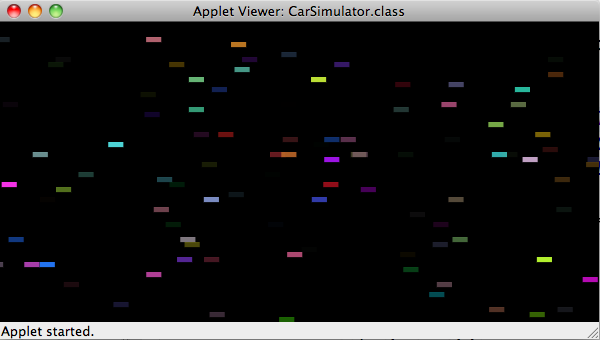
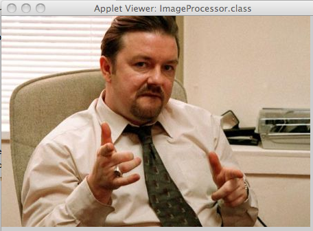
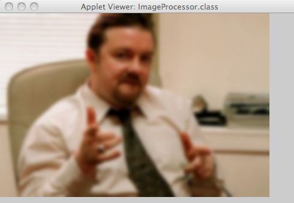

# Übungsblatt 10

## Wichtige Informationen zur Bearbeitung der Aufgabe 

 - [Informationen zur Entwicklungsumgebung *IntelliJ IDEA*](https://elearning.uni-regensburg.de/mod/book/view.php?id=1480675)
 - [Informationen zum Im- und Export von Projekten](https://elearning.uni-regensburg.de/mod/book/view.php?id=1480675&chapterid=51551)
 - [GraphicsApp](https://elearning.uni-regensburg.de/mod/url/view.php?id=1482162)

## Starterpaket

**Hinweis:** Im Starterpaket finden Sie vorgegebenen Code für die
unterschiedlichen Klassen sowie die beiden Bilddateien, die Sie als
Ausgangsmaterial für die entsprechenden Aufgaben verwenden können.

 - [Starterpaket](https://github.com/OOP-Regensburg/U10-GraphicsApp/archive/Starterpaket.zip)

## Car-Simulator

Erstellen Sie ein Programm, das den Verkehr auf einer mehrspurigen
Straße animiert:

-   Alle Fahrzeuge starten am linken Rand der Zeichenfläche.

-   Die Fahrzeuge fahren in Spuren, jede Spur ist so hoch wie die
    Fahrzeuge (die Fahrzeughöhe ist konstant).

-   Auf einer Spur können mehrere Fahrzeuge mit unterschiedlichen
    Geschwindigkeiten fahren.

-   Fährt ein Fahrzeug rechts aus dem Bild heraus, so wird seine
    Position wieder auf den Anfang derselben Spur gesetzt.

-   Jedes Fahrzeug hat eine zufällige Farbe inkl. Alpha-Transparenz
    (vgl. verfügbare Konstruktoren der Klasse `Color`).

-   Die Geschwindigkeit des Fahrzeugs wird ebenfalls zufällig bestimmt
    (zwischen `2.0` und `10.0`).



Die Klasse `Car` ist vollständig für die Berechnung der Fahrzeugfarben
und Positionen zuständig. Aus der Klasse `Cars` werden lediglich die Methoden `update``()` und `draw``()` der Objekte der Klasse `Car` aufgerufen. Gegeben ist der folgende Code:

    public class Cars extends GraphicsApp {

        private static final int CAR_NUM = 100;
        private static final int CAR_WIDTH = 15;
        private static final int CAR_HEIGHT = 5;
        private static final Color BG_COLOR = Color.BLACK;
        private static final int CANVAS_WIDTH = 600;
        private static final int CANVAS_HEIGHT = 300;
        
        private ArrayList<Car> cars;
        
        public void intialize() {
            setupCanvas();
            setupCars();
        }
        
        public void draw() {
            drawBackground(BG_COLOR);
            drawCars();
        }
        
        private void setupCanvas() {
            setCanvasSize(CANVAS_WIDTH, CANVAS_HEIGHT);
            setFrameRate(FRAME_RATE);
        }

        /* Your code here... */

    public class Car {
        
        private float speed;
        private Rectangle car;
        private int canvasWidth;

        private static final float MIN_SPEED = 2;
        private static final float MAX_SPEED = 10;

        private Random random;
        
        public Car(int carWidth, int carHeight, int canvasWidth, int canvasHeight) {
            this.canvasWidth = canvasWidth;
            random = new Random();
            
            Color carColor = createRandomColor();
            int randomYPos = getRandomYPos(carHeight, canvasHeight);
            speed = getRandomSpeed();
            
            car = new Rectangle(0, randomYPos, carWidth, carHeight, carColor);
        }
        
        /* Your code here... */

## Image Processing I - Bild spiegeln

Schreiben Sie eine Methode `flipImageHorizontal``(Image img)`, welche
aus einem Image-Objekt die Pixel-Daten ausliest und anschließend so
umdreht, dass das Bild horizontal gespiegelt und dann als neues
Image-Objekt zurückgegeben wird.


Gegeben ist folgender Rumpf:
```
    public class ImageProcessing extends GraphicsApp {
    
        private Image sourceImage;
        private Image workingCopy;
        
        public void intialize() {
            setupCanvas();
            setupImages();
        }
        
        public void draw() {
            drawBackground(BACKGROUND_COLOR);
            workingCopy.draw();
        }
        
        private void setupCanvas() {
            setCanvasSize(CANVAS_WIDTH, CANVAS_HEIGHT);
            setFrameRate(FRAME_RATE);
        }

        private void setupImages() {
            sourceImage = new Image(0, 0, "data/assets/sopranos.jpg");
            workingCopy = new Image(0, 0, "data/assets/sopranos.jpg");
        }
        
        private Image flipImageHorizontal(Image img) {
            // image flipping code here
            return img;
        }

        public void onKeyPressed(KeyPressedEvent event) {
            workingCopy = flipImageHorizontal(workingCopy);
            workingCopy.draw();
        }
    }
```
**Erweiterung:** Implementieren Sie die Methode
`flipImageVertical``(Image img)`, mit deren Hilfe das Bild vertikal
gespiegelt wird.

## Image Processing II: Weichzeichnen

Bildverarbeitung ist ein wichtiges Thema im Design und der
Computergraphik. Um zu verstehen, wie Programme wie zum Beispiel
Photoshop oder Gimp mit Pixelmanipulation komplette Bilder verändern,
sollen Sie ähnlich wie bei der vorherigen Aufgabe nun einen
Weichzeichnerfilter (Blur) implementieren. **Ein verschwommener Pixel
entspricht den Durchschnittswerten aller Farbwerte des Pixels selbst und aller Farbwerte der umgebenden Pixel**. Die Effekte eines Weichzeichners zeigen die folgenden Abbildungen.





Erweitern Sie die bestehende Lösung der Aufgabe `FlipImage` um eine
weitere Methode `blurImage``(Image img)`, die ebenfalls durch Tastendruck aufgerufen werden kann.Im Gegensatz zum einfachen Spiegeln reicht es hierbei nicht aus, einzelne Pixel zu vertauschen, sondern Sie müssen auch die umliegenden Pixel miteinbeziehen (kontextabhängige Pixelmanipulation).

Um einen Pixel verschwimmen zu lassen, benötigen Sie die
Farbinformationen der Pixel darüber, darunter und rechts und links
daneben. Iterieren Sie in der entsprechenden Methode in einer zweifach
verschachtelten Schleife die Pixel folgendermaßen:

    for (int y = 0; y < sourcePixels.length; y++) {
        for (int x = 0; x < sourcePixels[y].length; y++) {
            // ...
        }
    }

Auf diese Weise können Sie die Variablen x und y wie Koordinaten im Bild verwenden (`sourcePixels[y][x-1]`liegt zum Beispiel links neben dem Pixel`sourcePixels[y][x]`.) Um nun Ihr Bild mit einem Blur-Filter zu belegen, benötigen Sie die unveränderten Farbwerte der Pixel um den zu verändernden Pixel herum, deshalb ist es wichtig, sich das ursprüngliche Pixelarray (hier sourcePixels) abzuspeichern und nicht zu verändern, sondern das Ergebnis der Pixelmanipulation in ein neues Pixelarray (hier targetPixels) abzuspeichern.

Für den Punkt an der Stelle y\|x benötigen Sie also Farbwerte der Punkte um diesen Punkt herum, um dann den Durchschnittswert der Farben zu errechnen und somit das Bild etwas verschwimmen zu lassen.


Errechnen Sie nun von allen umliegenden Pixeln (siehe oben) und dem
Pixel selbst aus der entsprechenden Farbe die Durchschnittswerte für
rot, grün und blau und erstellen Sie daraus eine neue Farbe, die Sie
dann folgendermaßen in das `targetPixels `Pixelarray schreiben können:

    Color color = new Color(red, green, blue);
    int result = color.toInt();
    // ...
    targetPixels[y][x] = result;

Beachten Sie dabei, dass überprüft werden muss, ob der entsprechende
Pixel überhaupt noch im Bild liegt (bei \[0\]\[0\] liegen die Pixel
links und darüber nicht mehr im Array).


